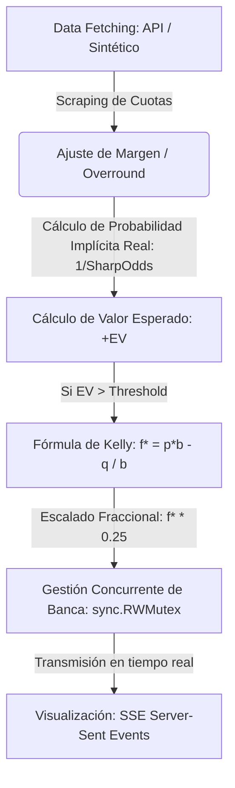

# Skill: Explicación y Lógica del Sports Betting Bot

Esta skill sirve como documentación viva y explicativa sobre el funcionamiento del bot, sus bases matemáticas (Criterio de Kelly, +EV, Arbitraje) y su flujo de datos. Está redactada con un enfoque dual: intuitivo ("para dummies") y analítico ("para científicos de datos").

---

## 🍎 Explicación de la Lógica "Para Dummies" (Conceptos Básicos)

Imagina que vas al supermercado a comprar manzanas. En la tienda de tu barrio, una manzana cuesta **$1.00**. Pero hablas con un amigo experto en frutas que te dice: *"Oye, el valor real de esa manzana, por su calidad y escasez, debería ser de **$1.50**"*. 

Si compras esa manzana a $1.00 sabiendo que vale $1.50, estás haciendo un trato con **"Valor Esperado Positivo"**. Si repites este proceso muchas veces, la estadística dice que vas a ganar dinero de forma matemática y consistente.

Eso es exactamente lo que hace este bot, pero con apuestas deportivas. El bot repite este bucle de 3 pasos cada **8 segundos**:

### 1. El "Cazador de Precios" (Escáner de Cuotas)
El bot entra a internet y revisa los "precios" (que en deportes se llaman **cuotas**) de diferentes partidos en muchas casas de apuestas a la vez (como Bet365, Pinnacle, DraftKings o Polymarket). 
* *La analogía:* Es como una aplicación que compara el precio de la leche en todos los supermercados de la ciudad al mismo tiempo.

### 2. El "Cerebro Matemático" (¿Hay negocio aquí?)
El bot toma como referencia a la casa de apuestas más inteligente del mundo (usualmente **Pinnacle** o mercados predictivos como **Polymarket**). A esta casa la llamamos la **cuota justa** (*Sharp Odds*).
- **Cálculo de Valor Esperado (+EV):** Si otra casa de apuestas (por ejemplo, Bet365) está ofreciendo una cuota muy superior a la cuota justa, el bot detecta una **anomalía de precio**. Significa que esa apuesta paga más de lo que la probabilidad matemática real sugiere.
- **Criterio de Kelly (Gestión de Riesgo):** El bot utiliza una fórmula matemática de los años 50 (el *Criterio de Kelly*) que calcula **cuánto dinero exacto** apostar de tu banca (por ejemplo, el 2% o el 4.5%) basándose en qué tan grande es la ventaja detectada y la probabilidad de ganar, reduciendo el riesgo de quiebra al mínimo.

### 3. El "Ejecutor y Administrador" (Simulación y Resultados)
El bot registra la apuesta simulada de forma instantánea en su base de datos local y, para acelerar las pruebas, simula el final del partido en unos pocos segundos basándose en las probabilidades reales de cada equipo. 
* *La analogía:* El bot compra la manzana barata, espera a que termine el día, registra si ganó o perdió, y actualiza tu cuenta de banco en tiempo real en la pantalla.

---

## 🧪 Explicación de la Lógica "Para Científicos de Datos" (Conceptos Analíticos)

A nivel matemático y computacional, el motor del bot opera bajo un modelo probabilístico discreto y optimización de portafolios en tiempo real:

### 1. Extracción de la Probabilidad Verdadera (No-Vig Probability)
Las cuotas de las casas de apuestas incluyen un margen de ganancia (*overround*). El bot normaliza las probabilidades implícitas del mercado de referencia (*Sharp*) para extraer la **distribución de probabilidad verdadera** ($p$ para la victoria del local, $q$ para el visitante):
$$p = \frac{1}{\text{Cuota}_{\text{SharpHome}}}$$
$$\text{Margen} = \frac{1}{\text{Cuota}_{\text{SharpHome}}} + \frac{1}{\text{Cuota}_{\text{SharpAway}}}$$
$$p_{\text{normalizada}} = \frac{p}{\text{Margen}}$$

### 2. Valor Esperado (+EV)
El bot evalúa si existe ineficiencia en las cuotas ofrecidas por otras casas ($b_i$, donde la cuota neta es $\text{Cuota} - 1$):
$$\text{EV} = (p_{\text{normalizada}} \times b_i) - (1 - p_{\text{normalizada}})$$
Solo se emiten apuestas donde el $\text{EV} > 0.0$ (o el umbral parametrizado en la configuración).

### 3. Optimización del Crecimiento Logarítmico (Kelly)
Para maximizar el crecimiento geométrico del capital a largo plazo y controlar el *drawdown*, aplicamos el **Criterio de Kelly Fraccionario**:
$$f^* = \text{Fracción} \times \left( \frac{p_{\text{normalizada}} \cdot \text{Cuota} - 1}{\text{Cuota} - 1} \right)$$
Donde `Fracción` está configurado por defecto en `0.25` (un cuarto de Kelly) para amortiguar la volatilidad inherente al mercado y mitigar la varianza extrema de la banca.

### 4. Concurrencia y Reactividad en Go
El escáner del motor matemático corre de forma asíncrona mediante **Goroutines** ligeras. La base de datos es un archivo transaccional JSON controlado por exclusiones mutuas (`sync.RWMutex`) para garantizar la consistencia ACID de las lecturas y escrituras concurrentes. La comunicación con la interfaz web se realiza en tiempo real sin polling mediante **Server-Sent Events (SSE)**.

---

## 📝 Historial de Cambios en la Lógica

*Este registro debe actualizarse cada vez que realicemos modificaciones o añadamos nuevas características matemáticas o lógicas al bot.*

* **2026-05-28 (Inicial):** 
  - Lanzamiento del bot con soporte para simulación de cuotas dinámicas y datos reales de *The Odds API*.
  - Implementación del Criterio de Kelly Fraccionario ($0.25$) y cálculo de valor esperado (+EV) con cuotas sharp normalizadas.
  - Corrección de la colisión de importación entre `crypto/rand` (alias `crand`) y `math/rand` (alias `mrand`) en `engine/bot.go`.
